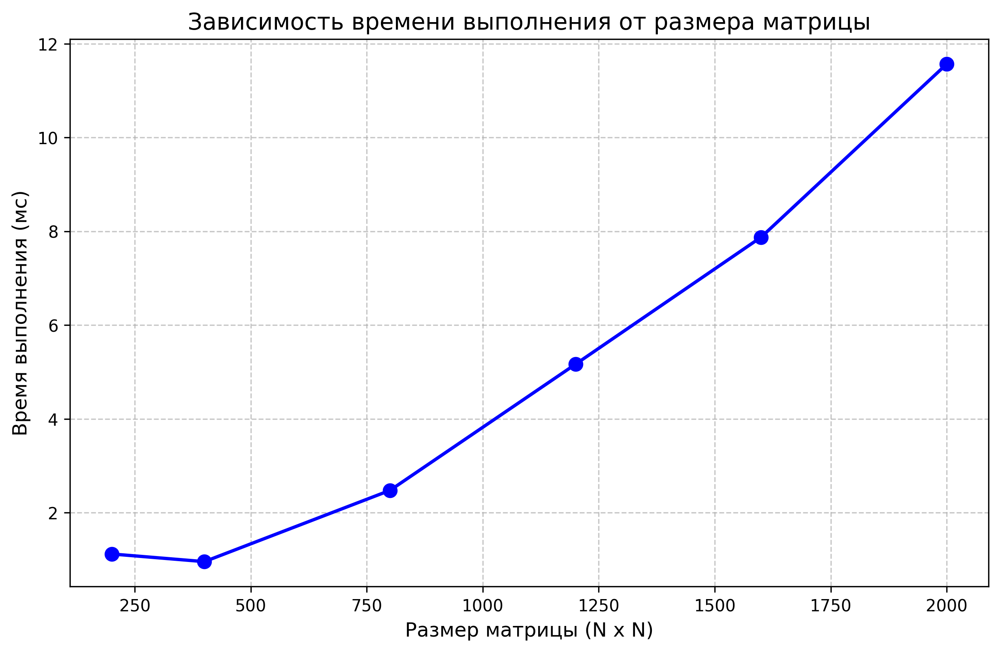

# Отчет по лабораторной работе: Параллельная обработка матриц

## 1. Постановка задачи
В качестве вычислительной задачи реализован алгоритм двумерной матричной кросс-корреляции (аналог свертки, широко применяемый в задачах компьютерного зрения и обработки изображений).
Размер применяемого ядра (фильтра) — 5x5.

В соответствии с требованиями задания, алгоритм реализован **вручную с использованием вложенных циклов**, без применения сторонних математических библиотек (таких как Eigen или BLAS) внутри вычислительного ядра. Это необходимо для обеспечения возможности последующего низкоуровневого управления потоками и разделения данных (Data Parallelism) по кэш-линиям процессора без возникновения конфликтов.

## 2. Оборудование и программная среда
* **Язык программирования:** C++ (Стандарт C++20).
* **Среда сборки:** CMake 3.15+, профиль сборки `Release`.
* **Оптимизация:** Применены агрессивные флаги оптимизации компилятора (`-O3`, `-march=native` для векторизации циклов с помощью SIMD-инструкций).
* **Многопоточность:** Базовая реализация `std::thread` с разделением исходной матрицы на горизонтальные блоки.
* **Верификация данных:** Автоматизированное тестирование на Python 3 с использованием `numpy`. Математическая корректность результатов C++ верифицируется путем сравнения с эталонной функцией `scipy.signal.correlate2d` (допустимая погрешность `1e-4`).

## 3. Результаты экспериментов (Последовательные/Многопоточные вычисления)
Для оценки вычислительной сложности и накладных расходов алгоритма проведены тесты на квадратных матрицах $N \times N$ от 200 до 2000. Время замерялось исключительно для вычислительного блока, исключая операции дискового ввода-вывода (I/O).

### Таблица измерений времени выполнения
| Размер исходной матрицы | Объем задачи (кол-во элементов) | Время выполнения (мс) |
| :--- | :--- | :--- |
| 200 x 200 | 40 000 | 1.12 |
| 400 x 400 | 160 000 | 0.95 |
| 800 x 800 | 640 000 | 2.47 |
| 1200 x 1200 | 1 440 000 | 5.17 |
| 1600 x 1600 | 2 560 000 | 7.87 |
| 2000 x 2000 | 4 000 000 | 11.57 |

*(Примечание: для матрицы 2000x2000 с ядром 5x5 алгоритм совершает около 100 миллионов математических операций с плавающей точкой).*

### Визуализация результатов (График зависимости)

## 4. Выводы и анализ результатов

По результатам проведенных экспериментов можно сделать следующие выводы:

1. **Накладные расходы на многопоточность (Thread Overhead):**
   На графике и в таблице наблюдается характерная аномалия на малых объемах данных: обработка матрицы 200x200 заняла больше времени (1.12 мс), чем обработка матрицы 400x400 (0.95 мс), объем которой в 4 раза больше. Это связано с тем, что время, затрачиваемое операционной системой на создание системных потоков (`std::thread`), контекстное переключение и их последующую синхронизацию (`join`), превышает время выполнения самих арифметических операций. **Вывод:** применение многопоточности на малых объемах данных нецелесообразно и ведет к деградации производительности.

2. **Асимптотическая сложность и масштабируемость:**
   Начиная с размерности 800x800, накладные расходы нивелируются. График демонстрирует уверенный нелинейный рост времени выполнения, который пропорционален квадрату размерности матрицы $O(N^2)$. Это полностью согласуется с теоретической алгоритмической сложностью $O(N^2 \cdot K^2)$, где $K$ — размер ядра.

3. **Эффективность работы с памятью (Cache Friendly):**
   Абсолютные показатели времени крайне малы (11.57 мс для 100 млн операций). Это доказывает правильность выбранной архитектуры: хранение двумерной матрицы в виде одномерного непрерывного массива (`std::vector`) и разделение вычислений строго по горизонтальным блокам. Такой подход позволил избежать ложного разделения (False Sharing) в кэш-линиях (L1/L2) между ядрами процессора и позволил аппаратному prefetcher'у работать с максимальной эффективностью.