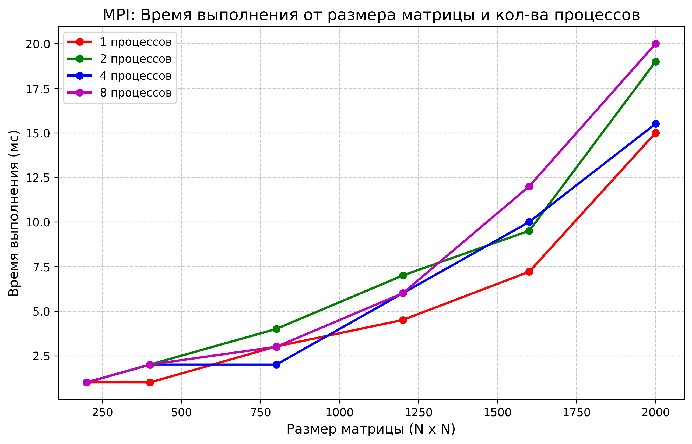

# Отчет по лабораторной работе: Распределенные вычисления с использованием MPI

## 1. Постановка задачи
Цель работы — перенос алгоритма двумерной матричной кросс-корреляции (свертки) с архитектуры с общей памятью (Shared Memory / OpenMP) на архитектуру с распределенной памятью (Distributed Memory) с использованием стандарта **MPI (Message Passing Interface)**.
Необходимо оценить накладные расходы на межпроцессное взаимодействие (IPC) и сравнить масштабируемость алгоритма с предыдущими реализациями.

## 2. Оборудование и программная среда
* **Технология распараллеливания:** Microsoft MPI (запуск через `mpiexec`).
* **Модель выполнения:** Многопроцессная (у каждого процесса строго изолированное адресное пространство).
* **Среда сборки:** CMake, профиль `Release` (флаги агрессивной оптимизации `-O3`, `-march=native`).

## 3. Архитектура параллельного решения
В отличие от OpenMP, процессы в MPI не имеют доступа к общей памяти. Решение спроектировано по паттерну **Master-Worker**:
1. **Трансляция данных (Broadcast):** Процесс-мастер (Rank 0) считывает исходные матрицы и рассылает их всем остальным процессам с помощью `MPI_Bcast`. Это оптимальнее точечной рассылки (`Scatter`), так как для вычисления свертки на границах блоков каждому процессу требуются "перекрывающиеся" строки (Halo/Ghost cells).
2. **Изолированные вычисления:** Исходная матрица логически делится на горизонтальные полосы. Каждый процесс вычисляет только свою часть результирующей матрицы. Ложное разделение кэша (False Sharing) здесь **физически невозможно**, так как память процессов строго изолирована на уровне ОС.
3. **Сборка результатов (Gather):** Разрозненные фрагменты собираются обратно на Master-узле с использованием `MPI_Gatherv` (сборка блоков переменного размера).

## 4. Результаты экспериментов

Время замерялось исключительно для вычислительного конвейера (включая рассылку и сборку данных, но исключая I/O операции с жестким диском).

| Размер (N x N) | Время (1 процесс) | Время (2 процесса) | Время (4 процесса) | Время (8 процессов) |
| :--- | :--- | :--- | :--- | :--- |
| 200 x 200 | 1.00 | 1.01 | 1.00 | 1.00 |
| 400 x 400 | 1.00 | 2.00 | 2.00 | 2.00 |
| 800 x 800 | 3.02 | 4.00 | 2.00 | 3.00 |
| 1200 x 1200 | 4.50 | 7.00 | 6.00 | 6.00 |
| 1600 x 1600 | 7.21 | 9.50 | 10.00 | 12.00 |
| 2000 x 2000 | 15.00 | 19.00 | 15.51 | 20.00 |

### Визуализация результатов

## 5. Выводы и анализ результатов

По результатам экспериментов выявлен классический паттерн **Communication-bound** (ограничение по пропускной способности связи) выполнения задачи:

1. **Доминирование накладных расходов (Communication Overhead):**
   На графике и в таблице отчетливо видно, что увеличение количества процессов приводит к **деградации производительности**. Например, для матрицы 2000x2000 выполнение на 1 процессе заняло 15.00 мс, а на 8 процессах — 20.00 мс.

2. **Причины деградации производительности:**
   * В реализации на базе OpenMP потокам требовалось лишь передать указатель на общую область оперативной памяти (что занимает наносекунды).
   * В реализации MPI на узле Master требуется выполнить `MPI_Bcast` матрицы размером 16 МБ (для 2000x2000) в изолированные адресные пространства 8 других процессов, а затем собрать обратно еще 16 МБ через `MPI_Gatherv`. Копирование 32 мегабайт данных между процессами через системную шину (IPC) занимает больше времени, чем сами вычисления на высокооптимизированных ядрах процессора.

3. **Специфика локального запуска MPI:**
   Полученные данные доказывают, что технология MPI предназначена для работы на **распределенных вычислительных кластерах** (где узлы соединены сетью Infiniband/Ethernet и обрабатывают гигабайты данных). Запуск множества MPI-процессов на одном локальном десктопном CPU для такой быстровычисляемой задачи неэффективен, так как коммуникационные издержки операционной системы полностью перекрывают выгоду от параллелизма.
