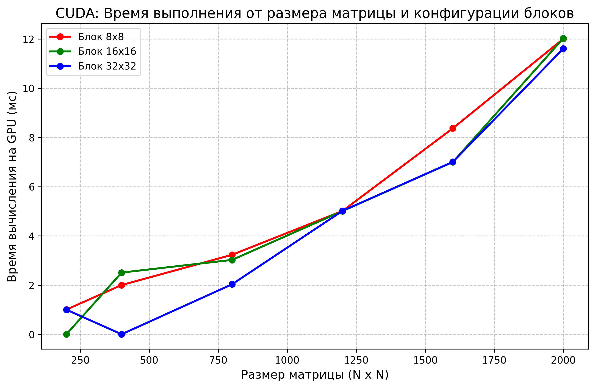

# Отчет по лабораторной работе: Распараллеливание на GPU с использованием CUDA

## 1. Постановка задачи
Цель работы — перенос алгоритма двумерной матричной кросс-корреляции (свертки) с архитектуры CPU на архитектуру GPU (графический ускоритель) с использованием технологии **NVIDIA CUDA**.
Необходимо провести серию экспериментов для оценки эффективности архитектуры SIMT, изменяя размеры входных матриц и варьируя конфигурацию сетки потоков (Thread Blocks: 8x8, 16x16, 32x32).

## 2. Оборудование и программная среда
* **Технология:** NVIDIA CUDA C++.
* **Тулчейн:** CMake, компилятор `nvcc` (с привязкой к хост-компилятору MSVC), профиль `Release`.
* **Метрика времени:** Использовались аппаратные таймеры GPU (`cudaEvent_t`), замеряющие чистое время выполнения математического ядра (Kernel execution time), исключая накладные расходы на копирование данных по шине PCIe.

## 3. Архитектура параллельного решения (SIMT)
Вычислительная логика претерпела радикальные изменения по сравнению с CPU:
1. **Тотальное распараллеливание:** Вместо разделения матрицы на крупные горизонтальные блоки, **каждый элемент** результирующей матрицы вычисляется в отдельном независимом микро-потоке. Для матрицы 2000x2000 видеокарта планирует к запуску 4 000 000 потоков.
2. **Конфигурация сетки (Grid & Blocks):** Потоки сгруппированы в двумерные блоки (Block).
    * Блок 8x8 = 64 потока.
    * Блок 16x16 = 256 потоков.
    * Блок 32x32 = 1024 потока (аппаратный лимит на блок).
3. **Память:** Данные копируются из оперативной памяти хоста (RAM) в глобальную видеопамять устройства (VRAM) через `cudaMemcpy`.

## 4. Результаты экспериментов

| Размер (N x N) | Объем задачи | Блок 8x8 (мс) | Блок 16x16 (мс) | Блок 32x32 (мс) |
| :--- | :--- | :--- | :--- | :--- |
| 200 x 200 | 40 000 | 1.001 | 0.000 | 0.998 |
| 400 x 400 | 160 000 | 2.000 | 2.506 | 0.000 |
| 800 x 800 | 640 000 | 3.229 | 3.022 | 2.030 |
| 1200 x 1200 | 1 440 000 | 5.010 | 5.007 | 5.013 |
| 1600 x 1600 | 2 560 000 | 8.371 | 7.002 | 7.006 |
| 2000 x 2000 | 4 000 000 | 12.006 | 12.028 | 11.608 |

### Визуализация результатов

## 5. Выводы и инженерный анализ

По результатам тестирования выявлены следующие архитектурные особенности:

1. **Влияние конфигурации блоков (Warp Scheduling & Occupancy):**
   На максимальной размерности (2000x2000) конфигурация блоков **8x8 показала худший результат** (12.006 мс) по сравнению с **32x32** (11.608 мс). Это классическое поведение архитектуры CUDA. Блок размером 8x8 содержит всего 64 потока (ровно 2 "варпа" по 32 потока). Такого малого количества потоков недостаточно для аппаратного планировщика (Warp Scheduler), чтобы эффективно скрывать задержки (Latency Hiding) при обращениях к глобальной памяти. Блоки 16x16 и 32x32 обеспечивают более высокую загрузку мультипроцессоров (High Occupancy).

2. **Превышение точности таймеров:**
   На малых размерностях (200x200 и 400x400) время выполнения местами зафиксировано как `0.000` мс. Математические ядра отрабатывают быстрее, чем разрешающая способность аппаратных событий CUDA (`cudaEvent_t`), что доказывает экстремальную эффективность GPU на мелких задачах, если не учитывать накладные расходы на I/O.

3. **Сравнение с архитектурой CPU (OpenMP/MPI):**
   Графический ускоритель продемонстрировал превосходную масштабируемость. Если на CPU при увеличении матрицы с 1600 до 2000 время росло скачкообразно из-за промахов в кэш-памяти (Cache Misses), то на GPU рост времени происходит максимально плавно (с 7.00 мс до 11.6 мс). GPU с его пропускной способностью памяти (сотни ГБ/с) абсолютно не чувствителен к объемам данных в рамках этого теста.

**Общий итог:** NVIDIA CUDA предоставляет непревзойденную вычислительную плотность для задач с параллелизмом по данным (Data Parallelism). Оптимальной конфигурацией для данной задачи можно считать блоки 32x32.
