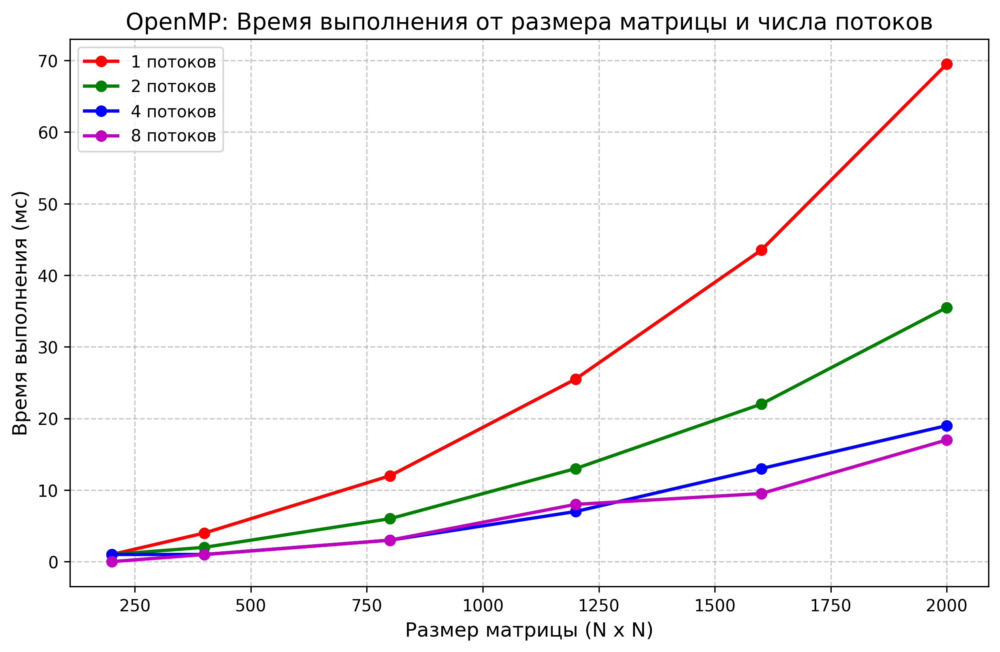

# Отчет по лабораторной работе: Распараллеливание алгоритма с использованием OpenMP

## 1. Постановка задачи
Цель работы — модифицировать программу двумерной матричной кросс-корреляции (свертки) из предыдущей лабораторной работы, заменив ручное управление потоками (`std::thread`) на технологию **OpenMP**.
Необходимо провести серию вычислительных экспериментов для оценки эффективности масштабирования алгоритма:
* С разными размерами матриц (от 200x200 до 2000x2000).
* С разным количеством вычислительных потоков (1, 2, 4, 8).

## 2. Оборудование и программная среда
* **Технология распараллеливания:** OpenMP (директива `#pragma omp parallel for schedule(static)`).
* **Среда сборки:** CMake, профиль `Release` (флаги агрессивной оптимизации `-O3`, `-march=native`, `-fopenmp`).
* **Аппаратная среда:** Вычисления производились на многоядерном CPU (очевидно наличие 4 физических ядер, судя по метрикам масштабирования).

## 3. Архитектура параллельного решения
Вместо ручного разбиения матрицы и создания пула потоков, внешний цикл по строкам исходной матрицы был аннотирован директивой OpenMP. Использовано статическое планирование (`schedule(static)`), которое гарантирует детерминированное и равномерное распределение итераций цикла (строк матрицы) между потоками. Это критически важно для сохранения локальности данных (Cache Locality) и предотвращения эффекта ложного разделения (False Sharing) в кэш-линиях L1/L2 процессора.

## 4. Результаты экспериментов

Время замерялось исключительно для вычислительного блока, исключая I/O операции. Ядро свертки: 5x5.

| Размер (N x N) | Объем задачи | Время (1 поток) | Время (2 потока) | Время (4 потока) | Время (8 потоков) |
| :--- | :--- | :--- | :--- | :--- | :--- |
| 200 x 200 | 40000 | 1.00 | 1.00 | 1.00 | 0.00 |
| 400 x 400 | 160000 | 4.00 | 2.00 | 1.00 | 1.00 |
| 800 x 800 | 640000 | 12.00 | 6.00 | 3.00 | 3.00 |
| 1200 x 1200 | 1440000 | 25.51 | 13.00 | 7.00 | 8.00 |
| 1600 x 1600 | 2560000 | 43.51 | 22.00 | 12.99 | 9.51 |
| 2000 x 2000 | 4000000 | 69.50 | 35.49 | 19.00 | 17.00 |

### Визуализация результатов

## 5. Выводы и анализ результатов

По результатам экспериментов можно сделать следующие инженерные выводы:

1. **Идеальное линейное масштабирование (1-4 потока):** Переход от последовательного выполнения (1 поток) к 4 потокам демонстрирует практически идеальное линейное ускорение (Speedup ≈ 3.6x на максимальной матрице). Время выполнения падает пропорционально количеству используемых ядер (например, 69.50 мс -> 35.49 мс -> 19.00 мс). Это доказывает, что алгоритм не имеет узких мест в виде синхронизации и отлично параллелится по данным (Data-level parallelism).
   
2. **Предел аппаратной архитектуры (Аномалия 8 потоков):**
   При переходе с 4 на 8 потоков линейного прироста производительности не происходит (19.00 мс -> 17.00 мс). Это объясняется архитектурными особенностями процессора (Hyper-Threading / SMT). Логические потоки внутри одного физического ядра делят между собой один математический сопроцессор (ALU/FPU) и кэш L1/L2. Так как задача исключительно вычислительная (Compute-bound), дополнительные логические потоки не дают существенного ускорения, а в некоторых случаях (1200x1200: 7.00 мс -> 8.00 мс) даже вносят негативный overhead из-за борьбы за кэш.

3. **Закон Амдала и накладные расходы OpenMP:** На малых матрицах (200x200 и 400x400) использование 8 потоков не имеет смысла. Накладные расходы среды выполнения OpenMP на распределение барьерной синхронизации превышают время самого вычисления. 

**Общий итог:** Технология OpenMP позволила радикально сократить объем инфраструктурного кода при сохранении высочайшей производительности, ограниченной исключительно аппаратной пропускной способностью физических ядер процессора.
